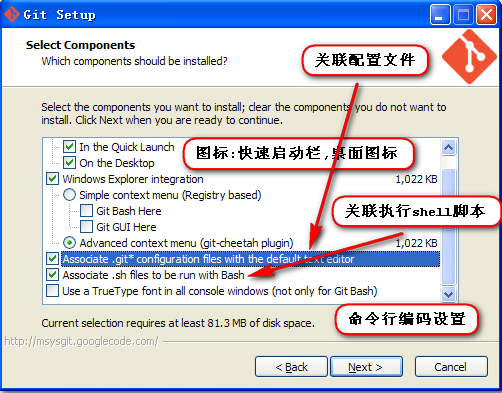
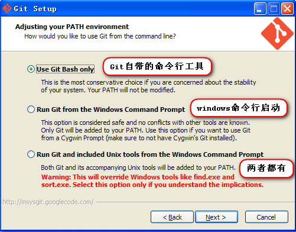
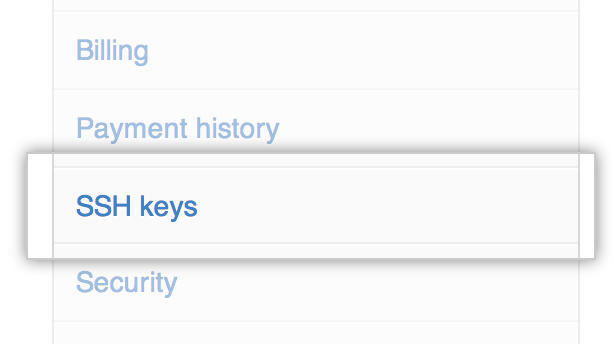

## 安装


## 基础配置和入门操作

### 安装
Git客户端下载地址: [点击跳转](https://git-for-windows.github.io/ 'https://git-for-windows.github.io/')

**安装步骤**  
略过欢迎页面、接受协议和选择安装目录步骤，从选择安装组件开始。
* 选择安装组件 : *可以默认选择*;
  - 图标组件(Addition icons) : 选择是否创建快速启动栏图标 或者 是否创建桌面快捷方式;
  - 桌面浏览(Windows Explorer integration) : 浏览源码的方法, 单独的上下文浏览 只使用bash 或者 只用Git GUI工具; 高级的上下文浏览方法 使用git-cheetah plugin插件;
  - 关联配置文件 : 是否关联git配置文件, 该配置文件主要显示文本编辑器的样式;
  - 关联shell脚本文件 : 是否关联Bash命令行执行的脚本文件;
  - 使用TrueType编码 : 在命令行中是否使用TruthType编码, 该编码是微软和苹果公司制定的通用编码;   



* 开始菜单快捷方式目录 : 设置开始菜单中快捷方式的目录名称, 也可以选择不在开始菜单中创建快捷方式;  


* 设置环境变量 : 选择使用什么样的命令行工具, 一般情况下我们默认使用Git Bash即可, 默认选择;
  - Git自带 : 使用Git自带的Git Bash命令行工具;
  - 系统自带CMD : 使用Windows系统的命令行工具;
  - 二者都有 : 上面二者同时配置, 但是注意, 这样会将windows中的find.exe 和 sort.exe工具覆盖, 如果不懂这些尽量不要选择;  



* 选择换行格式 : 
  - 检查出windows格式转换为unix格式 : 将windows格式的换行转为unix格式的换行在进行提交;
  - 检查出原来格式转为unix格式 : 不管什么格式的, 一律转为unix格式的换行在进行提交;
  - 不进行格式转换 : 不进行转换, 检查出什么, 就提交什么;  

  

之后就是正常安装了。

---

### 配置GitHub

1. 首先需要检查你电脑是否已经有 SSH key   

    运行 git Bash 客户端，输入如下代码：
    ```
    $ cd ~/.ssh
    $ ls
    ```
    这两个命令就是检查是否已经存在 `id_rsa.pub` 或 `id_dsa.pub` 文件，如果文件已经存在，那么你可以跳过步骤2，直接进入步骤3。


2. 创建本地ssh  

    在命令行工具里使用：`ssh-keygen -t rsa -C "xxxxx@163.com"`  

    代码参数含义：
    - -t 指定密钥类型，默认是 rsa ，可以省略。
    - -C 设置注释文字，比如邮箱。
    - -f 指定密钥文件存储文件名。  
    **GitHub邮箱 :** 该命令后面的邮箱就是GitHub的注册邮箱  
    以上代码省略了 -f 参数，因此，运行上面那条命令后会让你输入一个文件名，用于保存刚才生成的 SSH key 代码，如：  
    ```
    Generating public/private rsa key pair.
    # Enter file in which to save the key (/c/Users/you/.ssh/id_rsa): [Press enter]
    ```
    当然，你也可以不输入文件名，使用默认文件名（推荐），那么就会生成 `id_rsa` 和 `id_rsa.pub` 两个秘钥文件。  
    接着又会提示你输入两次密码（该密码是你push文件的时候要输入的密码，而不是github管理者的密码），当然，你也可以不输入密码，直接按回车。那么push的时候就不需要输入密码，直接提交到github上了，如：
    ```
    Enter passphrase (empty for no passphrase): 
    # Enter same passphrase again:
    ```
    接下来，就会显示如下代码提示，如：
    ```
    Your identification has been saved in /c/Users/you/.ssh/id_rsa.
    # Your public key has been saved in /c/Users/you/.ssh/id_rsa.pub.
    # The key fingerprint is:
    # 01:0f:f4:3b:ca:85:d6:17:a1:7d:f0:68:9d:f0:a2:db xxxx@163.com
    ```
    当你看到上面这段代码的时候，那就说明，你的 SSH key 已经创建成功，你只需要添加到github的SSH key上就可以了。

3. 将ssh配置到GitHub中  
- 进入生成的ssh目录（默认） : `C:\Users\Administrator\.ssh` 中, 使用记事本打开 `id_rsa.pub` 文件, 将该文件中的内容复制。  
或者git命令复制该文件的内容  `$ clip < ~/.ssh/id_rsa.pub`
- 登录你的github账号，从又上角的设置（ Account Settings ）进入，然后点击菜单栏的 SSH key 进入页面添加 SSH key。
- 点击 Add SSH key 按钮添加一个 SSH key 。把你复制的 SSH key 代码粘贴到 key 所对应的输入框中，记得 SSH key 代码的前后不要留有空格或者回车。当然，上面的 Title 所对应的输入框你也可以输入一个该 SSH key 显示在 github 上的一个别名。默认的会使用你的邮件名称。  




4. 测试一下SSH key  

    在git Bash 中输入以下代码  
    ```
    $ ssh -T git@github.com
    ```  
    当你输入以上代码时，会有一段警告代码，如：
    ```
    The authenticity of host 'github.com (207.97.227.239)' can't be established.
    # RSA key fingerprint is 16:27:ac:a5:76:28:2d:36:63:1b:56:4d:eb:df:a6:48.
    # Are you sure you want to continue connecting (yes/no)?
    ```
    这是正常的，你输入 yes 回车既可。  
    如果你创建 SSH key 的时候设置了密码，接下来就会提示你输入密码，如：
    ```
    `Enter passphrase for key '/c/Users/Administrator/.ssh/id_rsa':`
    ```
    当然如果你密码输错了，会再要求你输入，直到对了为止。

    **注意：输入密码时如果输错一个字就会不正确，使用删除键是无法更正的。**

    密码正确后你会看到下面这段话，如：
    ```
    Hi username! You've successfully authenticated, but GitHub does not
    # provide shell access.
    ```
    如果Hi后面的用户名是正确的,你已经成功设置SSH密钥。如果你看到 “access denied” ，者表示拒绝访问，那么你就需要使用 https 去访问了。  
	这样进行远程仓库操作的时候就需要输入密码，本地记住密码，只需要执行下面的这条命令  
	```
	git config --global credential.helper store

	```


### Git 配置  
    git config -e [--global] # 编辑Git配置文件
1. 配置用户名和邮箱
用户名邮箱作用 : 我们需要设置一个用户名 和 邮箱, 这是用来上传本地仓库到GitHub中, 在GitHub中显示代码上传者;  
**使用命令：**
```
git config --global user.name "yourname" //设置用户名  
git config --global user.email "your email"  //设置邮箱  
```

2. 配置自动换行  
```
git config --global core.autocrlf input #提交到git是自动将换行符转换为lf
```

3. 彩色的git输出
```
git config --global color.ui true
```

4. 配置别名
```
git config --global alias.st status #git st
git config --global alias.co checkout #git co
git config --global alias.br branch #git br
git config --global alias.ci commit #git ci
```

5. 设置显示中文文件名  
```
git config –global core.quotepath false 
```

5. 获取配置列表和帮助
```
git config --list #查看配置的信息

git help config #获取帮助信息
```


### 创建一个工程需要的操作流程

* 新建仓库
```
touch README.md  
git init  
git add README.md  
git commit -m "first commit"  
git remote add origin git@github.com:qiqihaobenben/Front-End-Basics.git  
git push -u origin master  
```

* 从现有仓库克隆

```
git clone git@github.com:qiqihaobenben/Front-End-Basics.git 

git clone git@github.com:qiqihaobenben/Front-End-Basics.git myfile #克隆到自定义文件夹

之后操作跟上述相同，省略remote这一步。
```
