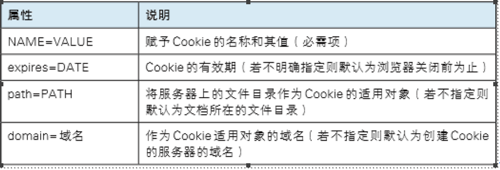

### 概念

http是一种无状态的协议，只有请求才会响应，然后断开，也没有记忆。  
互联网中的设备要完成通信必须基于双方都能识别的规则，如通信的语音，格式，硬件和操作系统等等，这些规则的集合统称为TCP/IP 协议族。

* URL（Uniform Resource Locator，统一资源定位符）是URI（统一资源标识符）的子集，URI可以标识网络中的任意资源，有了URI才能在海量的网络资源中找到我们需要的那部分。

* DNS（Domain Name System， 域名系统），因为IP地址的记忆实在是反人类，而域名机器识别不了，所以有了DNS将二者自由转换。

* ARP 是一种用以解析地址的协议，根据通信方的 IP 地址就，可以反查出对应的 MAC 地址。除了路由器外，信息要到达目标服务器地址可能还要经过代理服务器，网关等设备

### HTTP报文详解

用于HTTP协议交互的信息被称为HTTP报文。  


#### Cache-Control： 操作缓存的指令。主要有以下几种用法  

`Cache-Control: no-cache`  
表示客户端不接受缓存的响应，必须请求最新的资源。  
`Cache-Control: no-store`  
表示客户端不能缓存请求或者响应的任意一部分。  
`Cache-Control: max-age=604800（单位 ：秒）`  
max-age 数值代表资源保存为缓存的最长时间。当指定 max-age 值为0或者缓存超过最大时间，那么缓存服务器通常需要将请求转发给 源服务器。

---

#### Connection： 由于HTTP1.1后，客户端和服务端建立连接后可以多次通信，连接的是否中断可以依靠以下指令控制。  

`Connection: close`  
表示想断开当前连接。  
`Connection: Keep-Alive`  
表示想保持当前连接。

---

#### Date： 表明创建HTTP报文的日期和时间  

---

#### Upgrade： 用于检测 HTTP 协议及其他协议是否可使用更高 的版本进行通信，其参数值可以用来指定一个完全不同的通信协议。  

比如`Upgrade: websocket`

---

#### Via: 为了追踪客户端与服务器之间的请求和响应报文的传输路径。之前说过，一个请求的过程除了经过路由器外，还可能经过代理，网关等设备，这些设备的路径将被记录。

---

#### Warning: 一些警告信息。

---

#### Accept: 用户代理能够处理的媒体类型和优先级。  

`Accept: text/html,image/jpeg`  
客户端可以处理的媒体类型，包括文本和jpeg格式的图片

---

#### Accept-Charset: 用户代理支持的字符集 及字符集的相对优先顺序。  

`Accept-Charset: iso-8859-5, unicode-1-1;q=0.8`  
权重 q 值来表示相对优先级。

---

#### Accept-Encoding: 用户代理支持的内容编码及内容编码的优先级顺序。 

`Accept-Encoding: gzip, deflate,compress`

---

#### Accept-Language: 用户代理能够处理的自然语言集（指中文或英文等）及优先级。  

`Accept-Language: zh-cn`

---

#### Authorization: 用户代理的认证信息。  

---

#### Host: 请求的资源所处的互联网主机名和端口号。  

---

#### Range: Range: bytes=5001-10000 请求获取从第 5001 字节至第 10000 字节的资源

---

#### Referer: 请求的URI是哪个页面发起的。  

`Referer: http://www.xxx.com/index.html`  

---

#### User-Agent: 创建请求的浏览器或用户代理名称等信息  

---

#### Age: 源服务器在多久前创建了响应。字段值的单位为秒。 `Age: 600`

---

#### Expires: 资源失效的日期。  

---

#### Last-Modified: 说明资源最终修改的时间。

---

#### Allow： 支持 Request-URI 指定资源的所有 HTTP 方法。`Allow: GET, HEAD`

---

#### Content-Type: 实体主体内对象的媒体类型。  

`Content-Type: text/html; charset=UTF-8`

---

#### Content-Encoding: 服务器对实体的主体部分选用的内容编码方式。  

`Content-Encoding: gzip`

---

#### Content-Language: 实体主体使用的自然语言（指中文或英文等语言）

---

#### Content-Length: 表明了实体主体部分的大小（单位是字节） 

`Content-Length: 15000`  
当我们获取下载进度信息时，常常使用使用这个信息。

---

#### Set-Cookie  

和cookie相关的信息。  

  

安全相关的2个属性  

---

#### Cookie: 如果想HTTP状态管理时，请求的首部加入  

`Cookie: status=enable`  
HTTP是无状态的，其状态管理要依赖于Cookie。

---

#### 状态码

  

